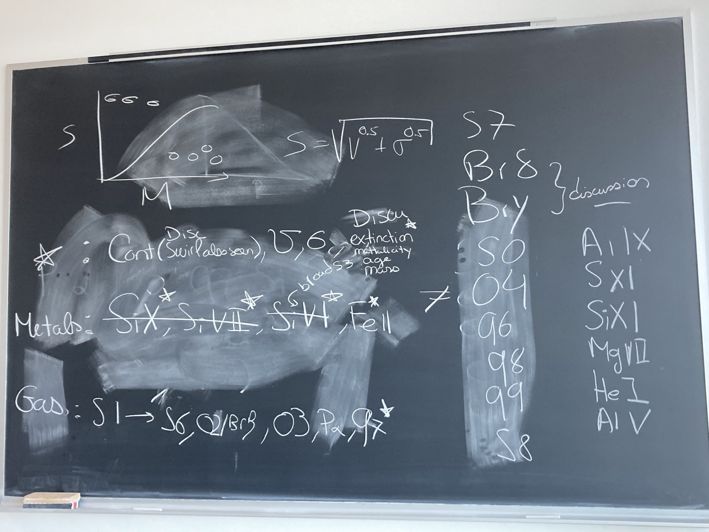

# JWST Workshop
Questions:
- For Fig. 1, how could I have the same FOV for both right subfigs if the layout is as currently ? Maybe place all the subfigs in one row?

Only velocity fields for the left lines
no detection for the right lines

- Two spiralling black holes may be pushing the stars
- We also see the "swirl" with the stars
- Entire section for the swirl in all bands and stars
- talk globally in the discussion about the extinction, metallicity, age and mass of the stars
- So a section on the swirl and section on the stellar properties in the discussion

fig 2: choose one of H2 (Paschen alpha is gonna be for the letter)

fig3: have all the main gas lines (bottom of the board in the photo)
add the other lines maybe in the appendix? (right side of the board in the photo)
calculate the S parameter (Cappellari) and plot it against the stellar mass
the way of rotation is different from the stellar component than for the gas components (discussion)

Fabian 2016 for having the radio jets (use VLBI contours approximately)
for fig 2, add a scale bar on the top of each sub fig in the top row, stellar mass for ("stellar flux"), add the radio jets and position of the AGN
for fig 3, have a single scale bar for each column, make about 5-6 rows of subfigs per page (there's about 11 lines), do not add the radio jets contour, but maybe the AGN?
Make the subfigures of fig 2 touch edges, colorbar have the same width than the subfig.

For next GM:
Make the fig 2 with the good data
Start fig 3?
